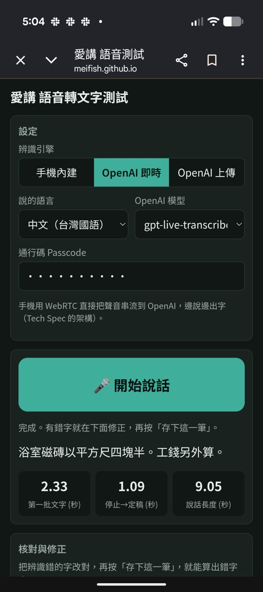
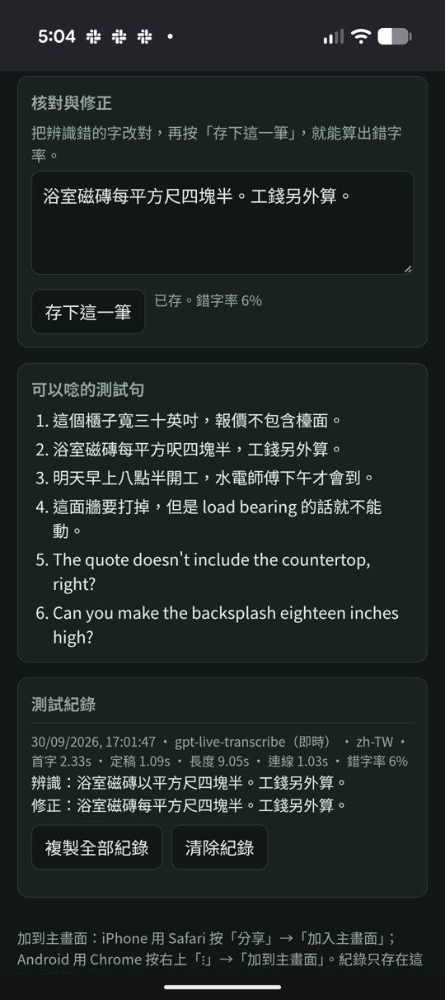

# Talkie AI 愛講｜語音轉文字測試頁

這是 Talkie AI 的 9/30 里程碑：一個不做視覺設計的手機網頁，用來測試語音轉文字的速度與準確度，可以加到手機主畫面使用。

- 測試頁：https://meifish.github.io/talkie/
- Cloudflare Worker：https://talkie-stt.meifish-kat.workers.dev（程式在 [`talkie-worker/`](../talkie-worker/)）
- 通行碼：請向 Kathryn 索取。這個 repo 是公開的，所以通行碼不放在這裡。

  
  

## 使用說明

### 第一次使用
1. 用手機開啟 https://meifish.github.io/talkie/。
2. 加到主畫面（建議）：
   - iPhone：用 Safari 開啟，按「分享」→「加入主畫面」。
   - Android：用 Chrome 開啟，按右上「⋮」→「加到主畫面」。
3. 第一次錄音時，瀏覽器會詢問麥克風權限，請按「允許」。

### 選擇辨識引擎
| 引擎 | 怎麼運作 | 需要 |
|---|---|---|
| **手機內建** | 用手機瀏覽器自己的語音辨識，邊說邊出字，免費 | 不用設定 |
| **OpenAI 即時** | 手機用 WebRTC 把聲音直接串流給 OpenAI，邊說邊出字。這是 Tech Spec 選定的架構 | 通行碼 |
| **OpenAI 上傳** | 說完才把整段錄音上傳給 OpenAI，用來比較延遲 | 通行碼 |

OpenAI 即時模式的預設模型是 `gpt-live-transcribe`，也可以切換成 `gpt-transcribe`、`gpt-4o-transcribe`、`gpt-4o-mini-transcribe` 來比較。

### 可以選的語言
選單平時只顯示中文（台灣國語、普通話、廣東話）和英文。選「其他語言…」會出現第二個選單，裡面是加拿大常見的語言：英文、加拿大法文、旁遮普語、印地語、烏爾都語、泰米爾語、古吉拉特語、巴西和葡萄牙的葡萄牙文、西班牙文、菲律賓語、阿拉伯語、波斯語、越南語、韓語、俄語、烏克蘭語、義大利語、波蘭語。選好語言後，下方的測試句會換成那個語言。

- **手機內建**：依手機而定。Android 大多都支援；iPhone 不支援旁遮普語、烏爾都語、泰米爾語、古吉拉特語、菲律賓語和波斯語（依 Apple 聽寫語言清單），這幾種在 iPhone 上請用 OpenAI。
- **OpenAI 上傳**：會把選的語言告訴 OpenAI。
- **OpenAI 即時**：不指定語言，由模型自動判斷，方便夾雜英文。

### 測一句話
1. 選「說的語言」和引擎。OpenAI 模式第一次要輸入通行碼，手機會記住。
2. 按 **🎤 開始說話**。
   - OpenAI 即時模式會先顯示灰色的「⏳ 連線中」，**變成紅色「⏹ 說完了，停止」才開始錄音**，這時再開口。連線大約需要 1 秒。
3. 唸頁面上的任一句測試句，或說你自己的句子。黃色字是即時草稿。
4. 說完按 **⏹ 停止**，等定稿文字出現。
5. 在「核對與修正」框裡把辨識錯的字改對，按 **存下這一筆**，就會算出錯字率。

### 看懂三個數字
| 數字 | 意思 |
|---|---|
| 第一批文字 | 開始錄音後，多久出現第一個字（OpenAI 上傳模式則是從按停止起算） |
| 停止→定稿 | 按停止後，多久拿到最後的定稿文字 |
| 說話長度 | 這次錄音多長 |

測試紀錄另外記錄了「連線」時間（OpenAI 即時模式從按下按鈕到連上 OpenAI 的時間），以及錯字率（CER，以字元計算，忽略標點和空白）。

### 匯出紀錄
按 **複製全部紀錄**，再貼到 Google 試算表，每一欄會自動分開。紀錄只存在這支手機的瀏覽器裡，換手機或清除瀏覽器資料就會不見。按兩次 **清除紀錄** 可以清空。

## 架構

- **OpenAI API key** 只存在 Cloudflare Worker 的 Secret 裡，不會出現在網頁或手機上。
- Worker 每次只發一張 10 分鐘有效的短效憑證（`ek_…`），並綁定這次的轉錄設定。
- OpenAI 即時模式的聲音直接從手機串流到 OpenAI，**不經過 Worker**。OpenAI 上傳模式則由 Worker 把整段錄音轉給 OpenAI，不會保存。

### 安全措施
- Worker 只接受來自 `https://meifish.github.io` 的請求。
- 每次請求都要帶正確的通行碼。在 Cloudflare 改掉 `PASSCODE`，舊的通行碼立刻失效。
- 只允許特定的轉錄模型，上傳的錄音最多 10 MB。
- OpenAI 專案設有每月用量上限，作為最後防線。

## 檔案
| 路徑 | 內容 |
|---|---|
| `talkie/index.html` | 測試頁（單一 HTML 檔，沒有外部相依）。`PROXY_URL` 設定 Worker 網址 |
| `talkie/opencc-cn2t.js` | [OpenCC](https://github.com/nk2028/opencc-js) 簡轉繁字典。選「中文（台灣國語）」時，辨識結果一律轉成台灣繁體 |
| `talkie/manifest.webmanifest`、`icon-*.png` | 加到主畫面用的設定與圖示 |
| `talkie-worker/worker.js` | Cloudflare Worker 程式，要手動貼到 Cloudflare 並按 Deploy |
| `talkie-worker/README.md` | Worker 的設定步驟 |
